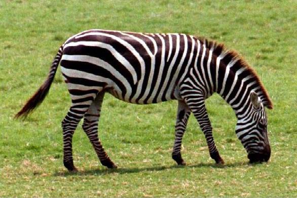

#Examples
## Change Point Model
This model was developed to learn the MCMC technologies. Gibbs sampler and HMC have been learned.
Three different models were implements. Two of them used Gibbs sampling based on Scipy and Pyro, separately, The rest one was based on No-U-Turn Sampling (HMC).


## Color Image Segementation
[code](Image denoising using Gibbs sampling and Ising model) developed EM Algorithm for image segmentation.
```
cd example/mrf_example
python image_segmentation.py
```



## Image Denoising
[code](Image denoising using Gibbs sampling and Ising model) developed Gibbs sampling and Ising model for image denoising.
The denoise function has bugs.
```
cd example/mrf_example
python image_denoising.py
```


# Hyperspectual Image Segemenation


